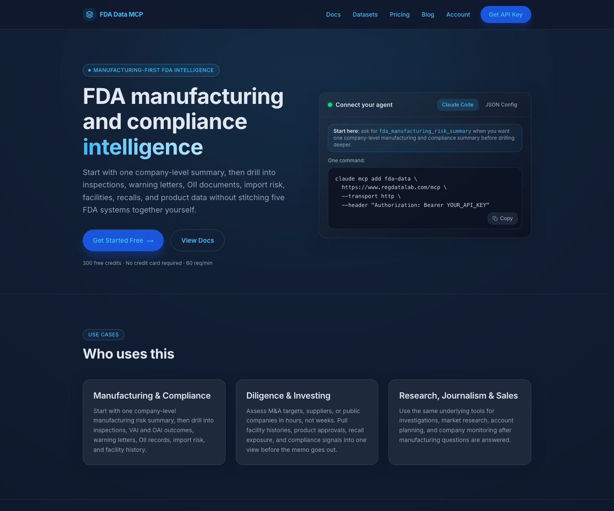

# FDA Data MCP

Hosted MCP server for FDA regulatory, manufacturing, and compliance intelligence.

This is the public install and discovery repo for **FDA Data MCP**. The live MCP endpoint is hosted at **RegDataLab**. The private backend, ingestion system, and production data pipeline are not open-sourced here.

[](https://www.regdatalab.com)
[](https://www.regdatalab.com/connect.md)
[](https://github.com/medley/fda-data-mcp/actions/workflows/pages/pages-build-deployment)



## Quick Links

- Website: [regdatalab.com](https://www.regdatalab.com)
- MCP endpoint: `https://www.regdatalab.com/mcp`
- Connect guide: [regdatalab.com/connect.md](https://www.regdatalab.com/connect.md)
- Product docs: [regdatalab.com/docs](https://www.regdatalab.com/docs)
- Pricing: [regdatalab.com/pricing](https://www.regdatalab.com/pricing)
- Signup: [regdatalab.com/signup](https://www.regdatalab.com/signup)
- Changelog: [CHANGELOG.md](./CHANGELOG.md)
- Releases: [github.com/medley/fda-data-mcp/releases](https://github.com/medley/fda-data-mcp/releases)

## What It Does

FDA Data MCP gives AI agents structured access to FDA data for questions like:

- Which facilities does this company operate?
- Has FDA inspected them recently?
- Were those inspections `NAI`, `VAI`, or `OAI`?
- Are there recalls, enforcement actions, or import refusals?
- What does FDA show for 510(k), PMA, Drugs@FDA, NDC, and related regulatory records?

The strongest current use case is **manufacturing and compliance intelligence** for pharma, biotech, and medtech teams.

## Quick Start

### Claude Code

```bash
claude mcp add fda-data https://www.regdatalab.com/mcp --transport http --header "Authorization: Bearer YOUR_API_KEY"
```

### Claude Desktop / Cursor / Windsurf

Add this to your MCP config:

```json
{
  "mcpServers": {
    "fda-data": {
      "url": "https://www.regdatalab.com/mcp",
      "headers": {
        "Authorization": "Bearer YOUR_API_KEY"
      }
    }
  }
}
```

### OpenAI / Generic MCP Clients

Use the same hosted endpoint:

- URL: `https://www.regdatalab.com/mcp`
- Auth header: `Authorization: Bearer YOUR_API_KEY`

### VS Code One-Click Install

[](https://insiders.vscode.dev/redirect/mcp/install?name=fda-data-mcp&inputs=%5B%7B%22password%22%3Atrue%2C%22id%22%3A%22fda-data-auth-header%22%2C%22type%22%3A%22promptString%22%2C%22description%22%3A%22FDA%20Data%20MCP%20Authorization%20header%20%28Bearer%20YOUR_API_KEY%29%22%7D%5D&config=%7B%22command%22%3A%22npx%22%2C%22args%22%3A%5B%22-y%22%2C%22mcp-remote%22%2C%22https%3A//www.regdatalab.com/mcp%22%2C%22--transport%22%2C%22http-only%22%2C%22--header%22%2C%22Authorization%3A%24%7Binput%3Afda-data-auth-header%7D%22%5D%2C%22env%22%3A%7B%7D%7D)

This uses the existing `mcp-remote` install pattern so users can connect to the hosted FDA Data MCP endpoint without running the private backend locally.

## Example Prompts

- `Give me a manufacturing risk summary for Pfizer.`
- `Show recent VAI and OAI inspections for Moderna.`
- `Summarize recalls, compliance actions, and import refusals for Thermo Fisher.`
- `What does FDA have on this company across facilities, inspections, and enforcement?`

## Data Coverage

FDA Data MCP covers live hosted access to datasets including:

- FDA inspections
- FDA citations
- FDA compliance actions
- FDA import refusals
- recalls and enforcement
- 510(k) clearances
- PMA approvals
- Drugs@FDA
- NDC directory
- drug labels
- device registrations and listings
- device UDI
- drug shortages

For the canonical and current product surface, use:

- [Docs](https://www.regdatalab.com/docs)
- [API page](https://www.regdatalab.com/api)

## Auth and Pricing

- Sign up for an API key at [regdatalab.com/signup](https://www.regdatalab.com/signup)
- Pass the key in the `Authorization: Bearer YOUR_API_KEY` header
- Free and paid plans are listed at [regdatalab.com/pricing](https://www.regdatalab.com/pricing)

## Why This Repo Exists

This repo is intentionally public and lightweight so it can serve as:

- the GitHub landing page for the hosted MCP
- a stable place for setup examples
- a future home for marketplace metadata and install helpers

The production backend and ingestion engine live separately.

## Support

- Docs: [regdatalab.com/docs](https://www.regdatalab.com/docs)
- Connect: [regdatalab.com/connect.md](https://www.regdatalab.com/connect.md)
- Email: [hello@regdatalab.com](mailto:hello@regdatalab.com)

## Changelog and Releases

- Version history lives in [CHANGELOG.md](./CHANGELOG.md)
- Public release notes live on the [GitHub releases page](https://github.com/medley/fda-data-mcp/releases)

## Security

If you find a security issue, do not open a public issue. Use the policy in [SECURITY.md](./SECURITY.md).
