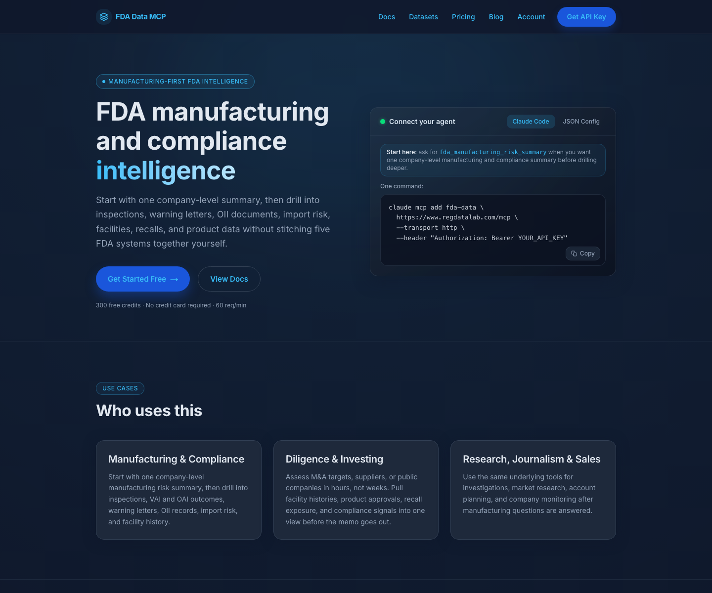

# FDA Data MCP

Hosted MCP server for FDA regulatory, manufacturing, and compliance intelligence.

This is the public install and discovery repo for **FDA Data MCP**. The live MCP endpoint is hosted at **RegDataLab**. The private backend, ingestion system, and production data pipeline are not open-sourced here.

[](https://www.regdatalab.com)
[](https://www.regdatalab.com/connect.md)
[](https://github.com/medley/fda-data-mcp/releases)
[](https://github.com/medley/fda-data-mcp/actions/workflows/pages/pages-build-deployment)



## Quick Links

- Website: [regdatalab.com](https://www.regdatalab.com)
- MCP endpoint: `https://www.regdatalab.com/mcp`
- Discovery metadata: [`https://www.regdatalab.com/.well-known/mcp.json`](https://www.regdatalab.com/.well-known/mcp.json)
- Connect guide: [regdatalab.com/connect.md](https://www.regdatalab.com/connect.md)
- Product docs: [regdatalab.com/docs](https://www.regdatalab.com/docs)
- Pricing: [regdatalab.com/pricing](https://www.regdatalab.com/pricing)
- Signup: [regdatalab.com/signup](https://www.regdatalab.com/signup)
- Changelog: [CHANGELOG.md](./CHANGELOG.md)
- Releases: [github.com/medley/fda-data-mcp/releases](https://github.com/medley/fda-data-mcp/releases)
- Wrapper package source: [`package.json`](./package.json)

## What It Does

FDA Data MCP gives AI agents structured access to FDA data for questions like:

- Which facilities does this company operate?
- Has FDA inspected them recently?
- Were those inspections `NAI`, `VAI`, or `OAI`?
- Are there recalls, enforcement actions, or import refusals?
- What does FDA show for 510(k), PMA, Drugs@FDA, NDC, and related regulatory records?

The strongest current use case is **manufacturing and compliance intelligence** for pharma, biotech, and medtech teams.

## Quick Start

### Claude Desktop

Add this to your Claude Desktop MCP config:

```json
{
  "mcpServers": {
    "fda-data": {
      "url": "https://www.regdatalab.com/mcp?apiKey=YOUR_API_KEY"
    }
  }
}
```

Config file location:
- macOS: `~/Library/Application Support/Claude/claude_desktop_config.json`
- Windows: `%APPDATA%\Claude\claude_desktop_config.json`

Restart Claude Desktop after saving.

### Claude Cowork

1. Go to Settings or Customize, then Connectors
2. Add a custom connector named `FDA Data`
3. Paste this URL (replace with your key):

```
https://www.regdatalab.com/mcp?apiKey=YOUR_API_KEY
```

4. Save and start a new project chat with the connector enabled

### Claude Code

```bash
claude mcp add fda-data \
  "https://www.regdatalab.com/mcp?apiKey=YOUR_API_KEY" \
  --transport http \
  --scope user
```

Verify with `/mcp`. You should see `fda-data` and the manufacturing-first toolset.

### Cursor

Add to `.cursor/mcp.json`:

```json
{
  "mcpServers": {
    "fda-data": {
      "url": "https://www.regdatalab.com/mcp?apiKey=YOUR_API_KEY"
    }
  }
}
```

### Windsurf

Add to `~/.codeium/windsurf/mcp_config.json`:

```json
{
  "mcpServers": {
    "fda-data": {
      "url": "https://www.regdatalab.com/mcp?apiKey=YOUR_API_KEY"
    }
  }
}
```

### ChatGPT / OpenAI API

```python
from openai import OpenAI

client = OpenAI()
response = client.responses.create(
    model="gpt-4.1",
    tools=[{
        "type": "mcp",
        "server_label": "fda-data",
        "server_url": "https://www.regdatalab.com/mcp",
        "require_approval": "never",
        "headers": {
            "Authorization": "Bearer YOUR_API_KEY"
        }
    }],
    input="Give me a manufacturing risk summary for Pfizer"
)
print(response.output_text)
```

### VS Code One-Click Install

[](https://insiders.vscode.dev/redirect/mcp/install?name=fda-data-mcp&inputs=%5B%7B%22password%22%3Atrue%2C%22id%22%3A%22fda-data-api-key%22%2C%22type%22%3A%22promptString%22%2C%22description%22%3A%22FDA%20Data%20MCP%20API%20key%20%28from%20regdatalab.com/signup%29%22%7D%5D&config=%7B%22command%22%3A%22npx%22%2C%22args%22%3A%5B%22-y%22%2C%22fda-data-mcp%22%5D%2C%22env%22%3A%7B%22FDA_DATA_API_KEY%22%3A%22%24%7Binput%3Afda-data-api-key%7D%22%7D%7D)

### Generic MCP clients

- URL: `https://www.regdatalab.com/mcp?apiKey=YOUR_API_KEY`
- Or with header: `Authorization: Bearer YOUR_API_KEY` to `https://www.regdatalab.com/mcp`
- Discovery file: `https://www.regdatalab.com/.well-known/mcp.json`

### npx wrapper (fallback for older clients)

For clients that don't support native HTTP URLs, use the stdio wrapper:

```bash
FDA_DATA_API_KEY=YOUR_API_KEY npx -y fda-data-mcp
```

Or in a JSON config:

```json
{
  "mcpServers": {
    "fda-data": {
      "command": "npx",
      "args": ["-y", "fda-data-mcp"],
      "env": {
        "FDA_DATA_API_KEY": "YOUR_API_KEY"
      }
    }
  }
}
```

The wrapper is a zero-dependency stdio-to-HTTP proxy:

- source: [`bin/fda-data-mcp.js`](./bin/fda-data-mcp.js)
- proxy: [`lib/stdio-proxy.js`](./lib/stdio-proxy.js)

If you do not have an API key yet, sign up here:

- [regdatalab.com/signup](https://www.regdatalab.com/signup)
- includes **300 free credits/month**

## Plugins for Claude and ChatGPT (preview)

[`plugins/regdatalab`](./plugins/regdatalab) packages the hosted server with five
research workflows (company compliance profile, facility due diligence, recall
research, supplier risk screen, product lookup) for Claude (claude.ai, Desktop,
Cowork, Claude Code) and ChatGPT plugins. Users sign in with their RegDataLab
account through OAuth instead of pasting a key into a URL.

OAuth sign-in for hosted Claude/ChatGPT is not switched on yet; until then use
the API-key setups above. See [install and test](./docs/plugins/INSTALL-AND-TEST.md)
and the [marketplace readiness checklist](./docs/plugins/SUBMISSION-CHECKLIST.md).

## Example Prompts

- `Give me a manufacturing risk summary for Pfizer.`
- `Show recent VAI and OAI inspections for Moderna.`
- `Summarize recalls, compliance actions, and import refusals for Thermo Fisher.`
- `What does FDA have on this company across facilities, inspections, and enforcement?`

## Data Coverage

FDA Data MCP covers live hosted access to datasets including:

- FDA inspections
- FDA citations
- FDA compliance actions
- FDA import refusals
- recalls and enforcement
- 510(k) clearances
- PMA approvals
- Drugs@FDA
- NDC directory
- drug labels
- device registrations and listings
- device UDI
- drug shortages

For the canonical and current product surface, use:

- [Docs](https://www.regdatalab.com/docs)
- [API page](https://www.regdatalab.com/api)

## Auth and Pricing

- Sign up for an API key at [regdatalab.com/signup](https://www.regdatalab.com/signup)
- Pass the key as `?apiKey=YOUR_API_KEY` in the URL (simplest)
- Or use the `Authorization: Bearer YOUR_API_KEY` header
- Or set `FDA_DATA_API_KEY=YOUR_API_KEY` when using the npx wrapper
- Free and paid plans are listed at [regdatalab.com/pricing](https://www.regdatalab.com/pricing)

## Why This Repo Exists

This repo is intentionally public and lightweight so it can serve as:

- the GitHub landing page for the hosted MCP
- a stable place for setup examples
- a future home for marketplace metadata and install helpers

The production backend and ingestion engine live separately.

## Support

- Docs: [regdatalab.com/docs](https://www.regdatalab.com/docs)
- Connect: [regdatalab.com/connect.md](https://www.regdatalab.com/connect.md)
- Email: [hello@regdatalab.com](mailto:hello@regdatalab.com)

## Changelog and Releases

- Version history lives in [CHANGELOG.md](./CHANGELOG.md)
- Public release notes live on the [GitHub releases page](https://github.com/medley/fda-data-mcp/releases)

## Security

If you find a security issue, do not open a public issue. Use the policy in [SECURITY.md](./SECURITY.md).
